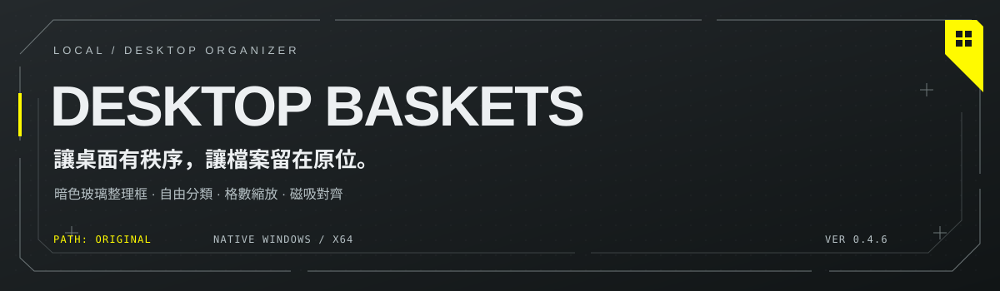

<p align="center">
  
</p>

<p align="center">
  <strong>你的桌面，就是你的工作區。</strong><br>
  自由分籃、框選整理、整組拖曳。讓檔案留在原位，讓桌面更有秩序。
</p>

<p align="center">
  
  
  
  
</p>

<p align="center">
  <a href="https://github.com/OverGreen996/DesktopBaskets/releases/download/v0.4.14/DesktopBaskets-Setup-0.4.14-x64.exe"></a>
  <a href="https://github.com/OverGreen996/DesktopBaskets/releases/download/v0.4.14/DesktopBaskets-Portable-0.4.14-x64.zip"></a>
</p>

<p align="center">
  <a href="#核心功能">核心功能</a> &nbsp;·&nbsp;
  <a href="#介面預覽">介面預覽</a> &nbsp;·&nbsp;
  <a href="#開始使用">開始使用</a> &nbsp;·&nbsp;
  <a href="https://github.com/OverGreen996/DesktopBaskets/issues">回報問題</a>
</p>

<p align="center">
  
</p>

## 介面預覽

<p align="center">
  
</p>

<p align="center"><sub>0.4.14 實際控制項繪製的框選預覽。桌面玻璃底色會透出你的桌布，文字與圖示維持不透明。</sub></p>

<details>
<summary><strong>展開：一般籃框、分類管理與最小尺寸</strong></summary>

### 桌面工作區


### 管理介面


### 5 × 1 格


在 76 × 99 px 的桌面圖示間距下，最小尺寸為 **476 × 250 px**。其他桌面間距的實際尺寸會不同。

預覽使用示範項目，不包含開發者的個人桌面檔案。

</details>

## 核心功能

Desktop Baskets 是 Windows 原生桌面分類工具。以《明日方舟：終末地》的介面語彙為視覺方向，使用暗色半透明玻璃、細切角邊框、黃色旗角與即時字體，讓整理框融入桌面。

| 能力 | 實際行為 |
| :--- | :--- |
| **直接拖入** | 桌面檔案、資料夾與捷徑可直接分類；框外不再重複顯示原生圖示。已有籃框保持可見，不再整批隱藏再顯示。 |
| **框選與多選** | 空白處拖出選取框；Ctrl 增減、Shift 連選、Ctrl+A 全選，包含目前捲動區外的項目。 |
| **整組拖曳** | 拖曳已選取的任一圖示，把整組移入另一籃子；桌面來源的整組項目也可拖回桌面空白處。 |
| **原生檔案操作** | 右鍵已選取項目保留多選，Windows Shell 處理開啟、複製、剪下、刪除與內容。支援時顯示深色完整選單。 |
| **原始路徑保留** | 分類與跨籃移動只改視覺歸屬，原檔不搬移、不複製，也不建立額外捷徑。 |
| **乾淨的捷徑名稱** | 圖示、提示名稱與分類管理隱藏 `.lnk`、`.url`、`.website`、`.appref-ms`；原始檔名與路徑保留。 |
| **空位自動補齊** | 分類後，後面的未分類圖示依桌面順序補上空位；重新整理後保留已整理位置並清除隱藏圖示的選取框。 |
| **桌面圖示避讓** | 新增、移動或放大整理框時，先把擋到的未分類圖示擠到可用位置。 |
| **按格數縮放** | 沿用系統桌面的圖示間距；最小 5 × 1 格，超出範圍可捲動。 |
| **磁吸與鎖定** | 靠近其他框會吸附對齊；點擊鎖頭或 STATUS 文字鎖定位置與大小。鎖定後框的游標維持一般箭頭，只有 LOCK 保留手形提示；框內檔案仍可操作。 |
| **即時資料** | 編號、檔案數、狀態、格數、版本與修訂日期都有實際用途。 |
| **低資源待命** | 30 秒無操作進入微待命，以事件喚醒；沒有持續動畫或桌面輪詢。 |

### 0.4.14 更新：LOCK 真正固定工作區

| 模組 | 本次更新 |
| :--- | :--- |
| **LOCK** | 黃色鎖頭與 STATUS 文字都是可點擊範圍，透明底板上的點擊也能正確切換。 |
| **CURSOR** | 鎖定時標頭、邊框、八個縮放邊角與黃色旗角維持一般箭頭，只有 LOCK 控制顯示手形。框內檔案維持正常操作游標。 |
| **INPUT** | 按下後的移動／放開送回原控制項，避免跨透明區漏掉點擊；鎖定時不能移動、縮放或雙擊標頭誤開編輯。 |
| **STANDBY** | 微待命仍保留 LOCKED 狀態；點擊可喚醒並解鎖，沒有新增閒置輪詢。 |

框選、多選整組拖曳、深色原生右鍵與捷徑隱藏副檔名等既有功能持續保留。

> 原生右鍵使用 Windows Shell 的**完整選單**，不是 Windows 11 的精簡排列。高對比模式或不支援的系統會保留系統樣式。

## 開始使用

1. 到 [Releases](https://github.com/OverGreen996/DesktopBaskets/releases/latest)，下載 **DesktopBaskets-Setup-0.4.14-x64.exe**。
2. 執行安裝程式。預設只安裝到目前 Windows 帳號，不需要系統管理員權限。
3. 從開始功能表開啟 **Desktop Baskets**，新增「遊戲」、「工作」、「雜項」等分類。
4. 把桌面項目拖進框內，雙擊即可開啟。
5. 在框內空白處按住左鍵拖曳，框選後即可一起整理。

安裝程式提供 **桌面捷徑** 與 **登入 Windows 時啟動** 兩個可選項，預設都不勾選。也提供 ZIP 免安裝版。

> 更新前，請先在程式或系統匣選 **「退出並還原圖示」**。按管理視窗的 × 只會藏到系統匣，桌面整理仍持續運作。

### 常用操作

| 操作 | 方法 |
| :--- | :--- |
| 框選 | 在籃框檔案區的空白處按住左鍵拖曳；邊框和標頭保留原本的移動／縮放功能。 |
| 增減／連續選取 | <kbd>Ctrl</kbd> + 點擊增減；<kbd>Shift</kbd> + 點擊連續選取。Ctrl 框選反轉框內選取，Shift 框選加入目前選取。 |
| 全選／清除 | <kbd>Ctrl</kbd> + <kbd>A</kbd> 全選；<kbd>Esc</kbd> 取消正在進行的框選或清除選取。 |
| 鍵盤多選 | Shift + 方向鍵延伸選取；Ctrl + 方向鍵移動焦點，Ctrl + 空白鍵切換該項目的選取。 |
| 自訂名稱 | 未鎖定時雙擊整理框標題，或開啟分類設定。 |
| 移動／縮放 | 拖曳標頭移動；拖曳邊緣、角落或右下十字按格數縮放。 |
| 鎖定／解鎖 | 點擊黃色鎖頭／圓點或旁邊的 STATUS 文字，也可從分類選單設定。鎖定後框邊維持一般箭頭，只有 LOCK 保留手形；框內檔案不受限制。 |
| 查看更多檔案 | 使用滾輪、右側細捲動條、方向鍵或 PageUp / PageDown。 |
| 移出分類 | 將框內圖示直接拖到桌面空白處，原生圖示會出現在落點附近，路徑不變。 |
| 檔案右鍵 | 開啟 Windows Shell 原生選單，使用系統的開啟、複製、刪除、內容等功能。 |
| 整組移動 | 先框選，再拖曳其中任一圖示到另一個籃子；按 Esc 取消拖曳。 |
| Delete 鍵 | 移出視覺分類，保留原檔。要刪除原始檔案，使用原生右鍵的「刪除」。 |
| 調整玻璃 | 分類設定中的底色濃度可設為 40–100%，預設 68%。 |
| 暫停或退出 | 使用「暫停並還原圖示」或「退出並還原圖示」。 |

## 安裝、設定與復原

- **系統**：Windows 10 / 11 x64，需 .NET Framework 4.8 或更新版本。
- **程式位置**：`%LOCALAPPDATA%\Programs\DesktopBaskets`。
- **分類與圖示位置備份**：`%LOCALAPPDATA%\DesktopBaskets\state.json`。
- **解除安裝**：先退出並還原圖示，再從 Windows 已安裝的應用程式移除。分類設定與桌面原始檔案會保留。
- **安裝檔簽章**：目前未提供 Authenticode 簽章。Release 同時附上 SHA-256 校驗檔。

目前支援具有實際檔案路徑的桌面項目。資源回收筒等特殊 Shell 項目尚不在拖入分類範圍內。

<details>
<summary><strong>資源設計與驗證紀錄</strong></summary>

原生 WinForms / C#，沒有瀏覽器引擎。檔案區使用虛擬化繪製，只畫可見項目；圖示快取最多 64 份，不為每個檔案建立控制項。

微待命會停止閒置計時器，清空圖示快取並一次性回收工作集；點擊、拖曳、鍵盤與捲動仍可喚醒。

本次框選在操作時重繪，沒有新增閒置輪詢；捷徑顯示名稱會快取，不會在每次繪製時讀取檔案系統。

| 驗證範圍 | 結果 |
| :--- | :--- |
| 版面與原始路徑 | 498 項自動檢查通過。 |
| 多選 | 雙向框選、Ctrl／Shift、全選、捲動、取消、重新整理後維持選取、跨籃移動及跨路徑原生複製。 |
| LOCK | 小框與大框、文字與圓點切換、八邊游標、鎖定拖曳、待命喚醒、設定保存及框外放開取消均通過。 |
| LOCK 滑鼠（0.4.14） | 實際點擊文字與鎖頭三次；鎖定後拖標頭與右下角，位置／尺寸不變，框邊游標為一般箭頭，檔案仍可選取。 |
| 框選滑鼠（0.4.12） | 真實籃框與玻璃底板的框選、兩個項目一起跨籃拖曳、Ctrl+A、Esc，以及原生內容顯示「2 個檔案」。 |
| 原生右鍵 | 本版右鍵訊息路由檢查通過。0.4.12 的多選深色選單曾保持開啟約 28.8 秒後正常執行內容命令。 |
| 本機更新 | 0.4.14 升級安裝驗證成功，安裝過程沒有改動分類設定。 |

滑鼠驗證使用實際籃框控制項與示範檔案，宿主為獨立測試視窗；工具無法直接選取 Explorer 下的個人桌面子視窗。拖回桌面的驗證結合拖曳事件與 Explorer 圖示返回落點，尚未完成端對端滑鼠拖回桌面的測試。

**資源數據的限制：** 0.4.5 曾量得待命工作集約 10.5 MiB、CPU 約 0.156%（單核心）；0.4.6 在另一輪環境量得約 12.34%，偏高原因尚未確定。0.4.14 尚未重做完整待命效能量測，因此不宣稱固定記憶體用量或極低 CPU。歷史數據與各版驗證範圍保留於 [驗證紀錄](docs/verification.json)。

</details>

## 從原始碼建置

Windows 上安裝 .NET SDK（6.0 或更新版本）及 .NET Framework 4.8 targeting pack：

```powershell
./scripts/build.ps1
```

產出位於 `dist/`。製作安裝版另需 [Inno Setup 6.7.3 或更新版本](https://jrsoftware.org/isdl.php)：

```powershell
./scripts/build.ps1 -Installer -IsccPath "C:\Program Files (x86)\Inno Setup 6\ISCC.exe"
```

```text
src/DesktopBaskets/    原生桌面程式
installer/            安裝程式腳本與繁體中文語系
scripts/              建置腳本
docs/                 說明、介面預覽與驗證結果
```

GitHub Actions 會建置免安裝版，執行版面、檔案路徑、框選、右鍵訊息路由與 LOCK 檢查。安裝版由 Inno Setup 腳本建置，正式檔案附於 Releases。

## 字型、相依與視覺來源

英文展示字體使用 **Russo One**；資訊與中文使用 Windows 系統字型。文字與邊框皆即時繪製，不以參考截圖當作 UI 背景。

相依與字型授權見 [THIRD_PARTY_NOTICES.md](THIRD_PARTY_NOTICES.md)。專案原始碼目前未指定授權條款。

本專案為獨立桌面工具，視覺方向受《明日方舟：終末地》啟發，未包含官方遊戲素材，亦非官方產品。
