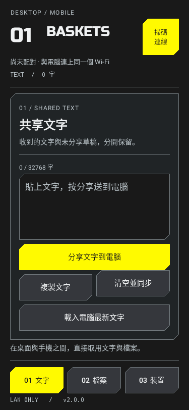
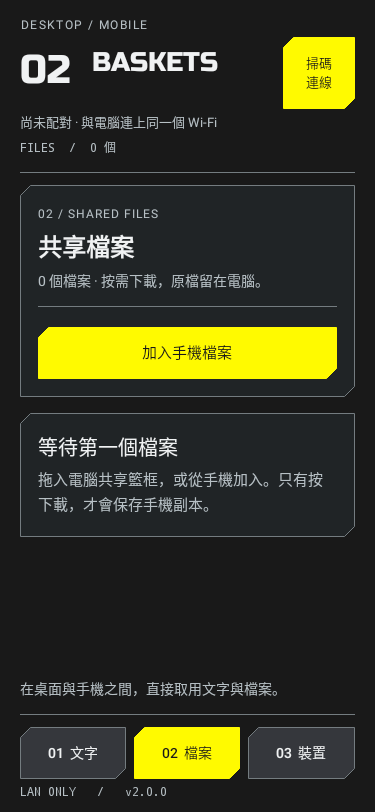
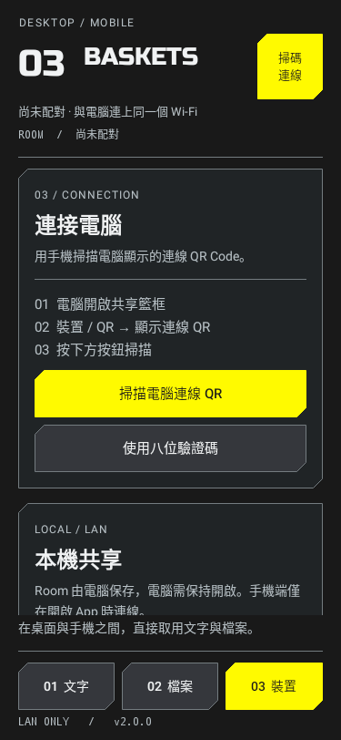

# Desktop Baskets Mobile 2.0.0

Android 原生伴侶 App，使用終末地美術參考包的字階、細線、切角與訊號黃。
介面使用真實文字及程式繪製輪廓，沒有 WebView、圖片文字或常駐動畫。

## 連線

1. 電腦 Desktop Baskets 建立「共享籃框」。
2. 選「裝置 / QR」→「顯示連線 QR」。
3. 手機按「掃碼連線」，掃描電腦 QR；兩端須在同一 Wi-Fi／LAN。

也能從裝置頁輸入八位驗證碼。QR 和驗證碼有五分鐘期限、僅能用一次。
PocketDrop 協定名稱與憑證驗證沿用，現有 PocketDrop Android 也能連線。

## 介面與資料

- 文字：分享、複製、載入最新內容；離開 App 保存草稿，收到內容不覆蓋草稿。
- 檔案：手機選取／分享進 App，查看電腦項目、按需下載、取消傳輸。
- 裝置：掃 QR、驗證碼、重新尋找、解除本機配對、手動檢查更新。
- 畫面編號對應頁面；字數、檔案數、配對狀態與版本均為真實資訊。
- 前景連線、後景停止狀態輪詢與搜尋；下載目錄保留 `Downloads/PocketDrop`。

此本地測試版本使用獨立應用程式 ID `local.desktopbaskets.mobile`，可與原
PocketDrop 並存，不覆蓋原 App 或配對資料；新 App 需要首次掃碼配對。
更新僅從 DesktopBaskets GitHub release 讀取，原 PocketDrop 更新不會替換此 App。

來源：OverGreen996/PocketDrop commit `f20173b9788d13be838d2ca036c1c465e4008046`。
保留 SRP、TLS pinning、憑證、重連、完整性及 Android 檔案分享處理。
沒有複製官方字型或圖像；展示字使用已授權 Russo One，OFL 在 assets 中。

## 建置與驗證

  
  
  

預覽由實際 Android 原生控制項透過 Robolectric 渲染，使用示範資料。
並非實體手機截圖。

使用 JDK 17、Gradle 8.11.1、Android SDK 35。Release 簽署由環境變數提供
`POCKETDROP_KEYSTORE`、`POCKETDROP_STORE_PASSWORD`、`POCKETDROP_KEY_ALIAS`、
`POCKETDROP_KEY_PASSWORD`，名稱保留原建置相容性；私鑰不加入 Git。

`gradle -p android assembleRelease lintRelease testReleaseUnitTest`

Robolectric 以實際 Android 控制項渲染窄螢幕、橫向、平板與放大文字預覽。
實體手機相機掃碼與真機傳輸須另行驗證，不把渲染測試當作真機測試。
